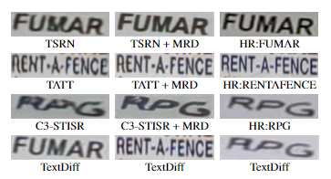

<div align="center">

 

</div>

<div align="center">

[简体中文](README.md) | [English](README_EN.md) | [Paper](https://arxiv.org/abs/2308.06743)
# TextDiff: Mask-Guided Residual Diffusion Models for Scene Text Image Super-Resolution
这里是论文[TextDiff: Mask-Guided Residual Diffusion Models for Scene Text Image Super-Resolution]((https://arxiv.org/abs/2308.06743))的官方复现仓库。TextDiff是一个场景文字超分辨率优化模型（详见[论文](https://arxiv.org/abs/2308.06743)).
</div>

# 网络结构
<div align="center">

 
 </div>

# News
- 置顶: 介绍一款我们实验室开发的多功能且多平台的<a href="https://www.aibupt.com/" title="OCR">OCR</a>软件,包含常用的各种OCR功能，例如PDF转word，PDF转excel，公式识别，表格识别以及自动去除水印功能，欢迎试用！
- 查看To-do lists，获取最新信息。
 
# 使用指南

## 环境配置
### 深度学习环境
- python >= 3.7
- pytorch >= 1.7.0
- torchvision >= 0.8.0
- lmdb >= 0.98
- pillow >= 7.1.2
- numpy
- six
- tqdm
- python-opencv
- easydict
- yaml

### 数据集
- <a href="https://github.com/WenjiaWang0312/TextZoom" title="点击可跳转到TextZoom">下载TextZoom数据集</a>

### 相关权重文件
- <a href="https://github.com/ayumiymk/aster.pytorch" title="点击可跳转到TextZoom">下载Aster model权重文件</a>
- <a href="https://github.com/Canjie-Luo/MORAN_v2" title="点击可跳转到TextZoom">下载Moran model权重文件</a>
- <a href="https://github.com/meijieru/crnn.pytorch" title="点击可跳转到TextZoom">下载CRNN model权重文件</a>

## 训练
1. 安装
```
git clone https://github.com/Lenubolim/TextDiff.git
```
2. 参数配置
<br> 见config.yaml文件 <br>

3. 训练
```
python train.py
```
## 推理
```
python test.py
```

# To-do lists

- [ ] 添加训练代码(soon)
- [ ] 添加推理代码(soon)
- [ ] 使用DPM_solver减少推理步长

 
# 效果图
<div align="center"> </div>

# 感谢

- 如果你觉得TextDiff对你有帮助，请给个star，谢谢！
- 如果你有任何问题，欢迎提issue(issue通知与我邮箱绑定，看到后我会及时回复)。
- 如果你愿意将TextDiff作为你的项目的baseline，欢迎引用我们的论文。


# References
<div id="refer-anchor-1"></div>

- [1] Scene text telescope:
Text-focused scene image super-resolution
- [2] Activating more pixels in image super-resolution
transformer.
- [3] Srdiff: Single image super-resolution
with diffusion probabilistic models.
- [4] DocDiff: Document Enhancement via Residual Diffusion Models
- [5]  Improving
Scene Text Image Super-Resolution via Dual Prior Modulation Network


# :book: Citation
If you use (part of) my code or find my work helpful, please consider citing
```
@article{liu2023textdiff,
  title={TextDiff: Mask-Guided Residual Diffusion Models for Scene Text Image Super-Resolution},
  author={Liu, Baolin and Yang, Zongyuan and Wang, Pengfei and Zhou, Junjie and Liu, Ziqi and Song, Ziyi and Liu, Yan and Xiong, Yongping},
  journal={arXiv preprint arXiv:2308.06743},
  year={2023}
}
```
# Acknowledgement
This code is developed relying on <a href="https://github.com/Royalvice/DocDiff" title="DocDiff">DocDiff</a> and <a href="https://github.com/mjq11302010044/TATT" title="TATT">TATT</a>. Thanks for these great projects. Among them, DocDiff is the main research content of my classmate, and I participated in part of the research.
